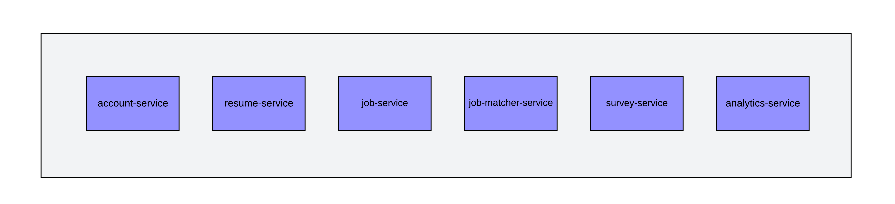

# Ctrl+Alt+Elite - O'Reilly Architectural Katas: Fall 2024

Hello! We are the Ctrl+Alt+Elite team hailing from Bangalore, India, and we are here to present our solution for the O'Reilly Architectural Katas: Fall 2024.

## Team Members 
[Krishnaraj Ramakrishna](https://www.linkedin.com/in/krishnaraj-vr-8869b45/)  
[Raghu A M](https://www.linkedin.com/in/raghu-a-m-6381b614/)  
[Santosh Kumar](https://www.linkedin.com/in/santoshk31/)

## Contents
- [Ctrl+Alt+Elite - O'Reilly Architectural Katas: Fall 2024](#ctrlaltelite---oreilly-architectural-katas-fall-2024)
  - [Team Members](#team-members)
  - [Contents](#contents)
  - [Introduction](#introduction)
    - [Problem Statement](#problem-statement)
  - [Requirements](#requirements)
    - [Business Requirments](#business-requirments)
      - [Epic-01 :: **Core System Module:**](#epic-01--core-system-module)
      - [Epic-02 :: **User (Candidate) Module:**](#epic-02--user-candidate-module)
      - [Epic-03 :: **HR/Recruiter Module:**](#epic-03--hrrecruiter-module)
      - [Epic-04 :: **Admin Module:**](#epic-04--admin-module)
    - [Technical Requirments](#technical-requirments)
      - [Epic-05 :: **Technical Requirements:**](#epic-05--technical-requirements)
  - [Assumptions](#assumptions)
  - [Architecture Characteristics](#architecture-characteristics)
    - [Architecture Styles](#architecture-styles)
  - [Top 3 Characteristics](#top-3-characteristics)
    - [1. **Scalability**](#1-scalability)
    - [2. **Performance**](#2-performance)
    - [3. **Interoperability**](#3-interoperability)
  - [Implicit Characteristics](#implicit-characteristics)
    - [Feasibility (Cost/Time)](#feasibility-costtime)
    - [Maintainability](#maintainability)
    - [Observability](#observability)
  - [Architecture Approach](#architecture-approach)
    - [Architecture Style](#architecture-style)
  - [Event Storming](#event-storming)
  - [Context](#context)
    - [Complete Overview](#complete-overview)
    - [Context Diagram](#context-diagram)
  - [Containers](#containers)
  - [Components](#components)
    - [API Application](#api-application)
    - [HR Orchestrator Engine](#hr-orchestrator-engine)
    - [AI Engine](#ai-engine)
      - [Vector Database](#vector-database)
      - [Knowledge Graph](#knowledge-graph)
      - [Retriever API](#retriever-api)
      - [Gen AI based LLM](#gen-ai-based-llm)
    - [Analytics Engine](#analytics-engine)
      - [Analytic Database](#analytic-database)
      - [BI Software](#bi-software)
      - [Batch Job](#batch-job)
        - [Amazon Glue](#amazon-glue)
        - [Amazon EMR](#amazon-emr)
  - [Deployment](#deployment)
      - [Regions](#regions)
      - [Availability Zones](#availability-zones)
      - [VPC (Virtual Private Cloud)](#vpc-virtual-private-cloud)
      - [Subnets](#subnets)
      - [EC2 Instances](#ec2-instances)
      - [RDS (Relational Database Service)](#rds-relational-database-service)
      - [Amazon Elastic MapReduce (EMR)](#amazon-elastic-mapreduce-emr)
      - [AWS Amplify](#aws-amplify)
      - [S3 Buckets](#s3-buckets)
      - [Application Load Balancers](#application-load-balancers)
      - [CloudWatch and Metrics](#cloudwatch-and-metrics)
  - [ADRs](#adrs)
  - [User Journey](#user-journey)
    - [User experience (UX) design](#user-experience-ux-design)
      - [Candidate](#candidate)
        - [Figma Walkthrough](#figma-walkthrough)
      - [Employer](#employer)
        - [Figma Walkthrough](#figma-walkthrough-1)
      - [Admin](#admin)
        - [Figma Walkthrough](#figma-walkthrough-2)

## Introduction
Discrimination in recruitment continues to be a significant global issue. Research shows that individuals from marginalized groups, such as people with disabilities, women, ethnic minorities, and members of the LGBTQ+ community, encounter various barriers in securing employment.

For instance, a Harvard Business School study found that ethnic minorities are 24% less likely to receive a callback for an interview compared to equally qualified white applicants. Additionally, the Pew Research Center reported that 42% of women experience workplace discrimination. Traditional hiring systems perpetuate unconscious bias, often preventing diverse talent from receiving equal consideration.

Organizations like the Diversity Cyber Council, a 501(c)(3) non-profit, are working to address these inequities, specifically in the tech industry. Through education, training, and staffing opportunities, they aim to create a sustainable and diverse talent pipeline. However, these efforts alone are insufficient without significant changes to the hiring process itself—this is where our application plays a key role.

### Problem Statement
The current hiring process faces significant challenges in promoting fairness and eliminating bias:

**Lack of Effective Metrics:** There is an absence of reliable metrics to accurately identify and reduce bias during recruitment. Many systems rely on diversity data early in the process, which can unintentionally introduce bias rather than prevent it. Our approach removes diversity-related data at the initial stages, ensuring decisions are made solely based on objective qualifications and experience.

**Ineffective Applicant Tracking Systems (ATS):** Traditional ATS, often referred to as HR systems, are redundant and inefficient in matching suitable candidates to job roles. This leads to missed opportunities, with qualified candidates frequently overlooked or mismatched due to poor filtering mechanisms.

Our solution eliminates diversity data from the early screening stages, creating a more objective and merit-based hiring process focused solely on candidates' qualifications.

## Requirements

### Business Requirments
#### Epic-01 :: **Core System Module:**
- **US-01:** As the ClearView system, I want to **generate AI-based resume tips,** so that job seekers can imprtes.
- **US-02:** As the ClearView system, I want to **manage invoicing for resume unlocks,** so that recruiters are charged for unlocking candidate information.
- **US-03:**  As the ClearView system, I want to **gather metrics and analytics,** so that system performance and user behavior can be monitored and improved.ove their resumes.
- **US-04:** As the ClearView system, I want to **anonymize resumes using AI,** so that candidate privacy is maintained until employers unlock the resumes.
- **US-05:** As the ClearView system, I want to **perform candidate-job matching,** so that job seekers can find relevant opportunities and recruiters can find suitable candida

#### Epic-02 :: **User (Candidate) Module:**
- **US-06:** As a job seeker, I want to **register**, upload, and update my resume, so that I can submit it for job opportunities.
- **US-07:** As a job seeker, I want to **view matched jobs** and manage the unlocking of my resume by employers, so that I can track my job applications.
- **US-08:** As a job seeker, I want to **anonymize my resume using AI,** so that I can maintain privacy before employers unlock my full information.
- **US-09:** As a job seeker, I want to **receive AI-generated resume tips,** so that I can improve my resume to increase my chances of getting hired.

#### Epic-03 :: **HR/Recruiter Module:**
- **US-10:** As a recruiter, I want to **register and enter company information using AI,** so that I can manage job postings and candidates.
- **US-11:** As a recruiter, I want to **post and update job descriptions,** so that I can attract relevant candidates to my job listings.
- **US-12:** As a recruiter, I want to **view candidate matches,** unlock resumes, and track their hiring status, so that I can streamline the hiring process.
- **US-13:** As a recruiter, I want to **mark candidates as hired or passed,** so that I can keep track of recruitment outcomes.

#### Epic-04 :: **Admin Module:**
- **US-14:** As an admin, I want to **manage user information and internal data,** so that I can ensure system operations run smoothly.
- **US-15:** As an admin, I want to **generate analytics and reports,** so that I can provide insights on system usage and candidate-employer interactions.
  
### Technical Requirments
#### Epic-05 :: **Technical Requirements:**
- **US-16:** Richest user interface possible across all deployment platforms.
- **US-17:** Users must be able to access the system at all times (max 5 minutes per month of unplanned downtime).
- **US-18:** Response time from web (800ms) and mobile (First-contentful paint of under 1.4 sec)

## Assumptions
- The application has no existing components and will be built from scratch.
- The solution is for a non-profit organization.
- An AI solution based on Large Language Models (LLMs) should be used. Assume a trained LLM for purposes of the solution
- The user interface (UI) will be web-based; no mobile app support is required.
- All HRMS systems provide APIs for integration.
- The system is primarily designed for the U.S. market.
- Resumes will be uploaded in PDF or MS word format.

## Architecture Characteristics
To ensure a successful system implementation, it's vital to prioritize key architecture characteristics. These elements guarantee reliability, availability, and responsiveness, delivering a seamless user experience.

### Architecture Styles

## Top 3 Characteristics
The key architectural characteristics of the recruitment system that leverages AI LLM for resume recommendations, candidate scoring, and job matching, while integrating with multiple HRMS systems, focus on **Scalability**, **Performance**, and **Interoperability**. Here's how these characteristics shape the system:

### 1. **Scalability**
- **Handling Growth**: The system must efficiently scale to accommodate an increasing number of candidates, resumes, and job postings as businesses expand. Scalability ensures smooth operation under fluctuating workloads, including more AI-driven analysis and HRMS integrations.
- **AI Resource Optimization**: As the system processes more resumes and handles higher candidate scoring and job matching volumes, resources need to be dynamically managed to support seamless AI model execution, especially during peak loads.

### 2. **Performance**
- **Fast AI-Driven Results**: High computational performance is essential for AI LLM models to provide real-time resume recommendations and candidate scoring, delivering immediate feedback to users on job matches and recommendations.
- **Efficient HRMS Data Retrieval**: The system must rapidly fetch job details and other data from multiple HRMS systems without introducing latency, ensuring job matching is prompt and system responsiveness is maintained.
- **Enhanced User Experience**: Fast, reliable responses to user actions—such as uploading resumes or generating job matches—are crucial for delivering a smooth and efficient experience for both candidates and recruiters.

### 3. **Interoperability**
- **Seamless HRMS Integration**: The system needs to integrate effortlessly with various external HRMS platforms, regardless of their underlying technology or data formats, ensuring smooth communication and data exchange.
- **Consistent Data Formatting**: With different HRMS systems potentially using varied data structures, interoperability ensures standardized data handling, enabling the AI models to process information accurately across platforms.
- **Future-Proofing**: Interoperability allows the recruitment system to integrate with new HRMS platforms or technologies over time, adapting to evolving business requirements without major re-engineering efforts.

## Implicit Characteristics
### Feasibility (Cost/Time)
Achieving rapid time-to-market while managing development costs is a feasible goal with the selected "mini-services" architecture.
### Maintainability
Ensuring clean code, documentation, and knowledge sharing within the development team are essential for long-term system maintainability.
### Observability
Implementing comprehensive monitoring and observability solutions enables efficient tracking of system performance and early issue detection for proactive problem-solving.

## Architecture Approach
### Architecture Style

  
## Event Storming
We conducted an Event Storming technique to identify the main components of the Clearview system. This collaborative workshop helped us visualize system workflows, identify domain events, and determine the interactions between components. Through this process, we [identified the necessary components and their relationships](EventStorming/EventStorming.md), informing the design and implementation of the system. Here are the results:

Each microservice operates within its defined bounded context, ensuring a clear separation of concerns. This modular approach enhances the system's maintainability, scalability, and overall performance, allowing each service to evolve independently while contributing to the cohesive functionality of the entire platform.

## Context
### Complete Overview

### Context Diagram
C1 in the C4 model, known as the Context view, offers a bird's-eye perspective of the system, illustrating its external interactions and dependencies. It depicts the system as a single entity surrounded by external actors, and environments with which it interacts. This view helps stakeholders understand the system's place within its broader ecosystem and the key interactions it has with its surroundings.

ClearView context diagram contains following elements:

* *Candidate (Actor)*  - A  Candidate is a professional who seeking a less tedious and more equitable hiring process that values their skills and abilities. 
* *Employer (Actor)*  - Companies invested in providing a more equitable experience to career seekers
* *Administrator (Actor)* - Oversees the HR system, managing user accounts for candidates and employers. 
* *ClearView System (Application)* -A platform that anonymizes candidate information while highlighting objective skills and qualifying experience with help of AI to reduce bias in the hiring process. .
* *Payment System (Application)* - The payment gateway system assists ClearView in processing payments.
* *HR Systems (Application)* - External HR systems are software platforms that organizations use to handle various HR tasks that are not managed within the ClearView application.

## Containers

* *Single Page Application*  - The frontend application that provides an interface for all types of users. 
* *API Application*  - A REST API built using microservices or macroservices, which is utilized by the frontend application. We use golang as a programming language [ADR-09](ADRs/ADR-09-Golang%20Programing%20Language.md)
* *HR Orchechrator engine* - Handles connections with HRMS systems and facilitates the sending of unlocked resumes. [ADR-12](ADRs/ADR-12-OrchestratorEngine.md%20Integration.md)
* *Analytics engine* - Provides an analytics interface for end users, either embedded in the Single Page Application or accessed directly by admins. It also processes events and transactional data for reporting.
* *Event Brocker* - Stores all application events, which are used by other components in an event-driven architecture. [ADR-15](ADRs/ADR-15-Kafka%20as%20event%20broker.md)
* *Trascational database* - A database used by the microservices or macroservices to store data such as users, roles, and resumes, etc.
* *Object Store* - Stores resumes in their raw format in a secure way
  
## Components
### API Application

ClearView component diagram contains following elements:

* *API Gateway (module)*  -The API Gateway serves as a bridge between external clients (users or systems) and internal services. It consolidates API requests, managing tasks such as request routing, composition, and often implementing features like rate limiting, security, and monitoring.
* *Aggregate API  (module)*  - The Aggregate API communicates with multiple services on behalf of external clients (such as users or systems), gathering and delivering data in a consolidated response.
* *Account API  (Module)* -  The Account API handles the management of candidate, employer, admin, and company information. 
* *Resume API (Module)* -Manages resumes and sends data to the AI service for story creation and anonymization.
* *Jobs API  (Module)* - Handles the management of all jobs created by the employer..
* *Job Matcher API  (Module)* - A module for finding and listing matches identified through AI.
* *Survey API (Module)* - A standalone service for managing user and employer surveys.
* *Invoice API (Module)* - Invoice data will be handled by the Invoice API.

### HR Orchestrator Engine

[ADR-12: Orchestrator Engine Integration using Kafka](ADRs/ADR-12-OrchestratorEngine.md%20Integration.md)
### AI Engine

#### Vector Database
Any resume that is created or uploaded, along with any job posting submitted, will be parsed into specific sections (e.g., skills, experience, job role) and then stored in the Vector Database with corresponding context embeddings. Detailed information in [ADR-03](ADRs/ADR-03-Vector%20Database.md).

#### Knowledge Graph
In parallel, we will extract key entities, attributes, and relationships from the job descriptions, skills, roles, and experience data, which will then be updated within the Knowledge Graph through graphical embeddings. Detailed information in [ADR-04](ADRs/ADR-04-Knowledge%20Graph.md).

#### Retriever API
Both the Vector Database and Knowledge Graph will leverage similarity metrics such as `Euclidean Distance`, `Cosine Similarity`, `Jaccard Similarity`, and `SimRank` to determine relevance. These metrics will return a list of matching records in real-time. The Retriever component will then perform an additional layer of filtering using thresholding or top-N result selection to eliminate low-relevance matches.

After filtering, the retriever will utilize an LLM to re-rank the remaining results based on their relevance to the query, improving overall matching accuracy. The integration of the Knowledge Graph and Vector Database helps mitigate hallucinations often seen in LLMs, significantly enhancing system accuracy. More details in re-ranker on the [ARD-05](ADRs/ADR-05-Document-ReRanker.md)

#### Gen AI based LLM 
Finally, we will use context-driven prompts within the LLM to generate tailored feedback for resumes or to create personalized story of candidate candidate-job matching recommendations. The personalized story would be done in batch processing to provide parallelism. We can also fine tune the above LLM on the survey feedback obtained by Candidates and by HR, on which further details are mentioned in [ARD-06](ADRs/ADR-06-LLM%20Fine%20tuning.md)

This approach provides high precision, reduces noise, and ensures an efficient, context-aware feedback loop for both candidates and HR professionals with near real-time feedback and highly performant candidate matching.

### Analytics Engine

Analytics Engine is used to process and organize all user, resume, job, interview, and feedback data, transforming it into a structured reporting format for analysis and insights.
#### Analytic Database
Amazon Redshift is a cloud-based data warehouse. It is specifically optimized for handling large-scale data analytics and reporting.
#### BI Software
Amazon QuickSight is a cloud-powered business intelligence (BI) service that integrates well with data sources like Amazon Redshift, enabling organizations to build data visualizations, dashboards, and reports as part of an analytics engine.
#### Batch Job
##### Amazon Glue
Amazon Glue is a fully managed Extract, Transform, Load (ETL) service designed to clean, transform, and load data into a data warehouse (e.g., Amazon Redshift) or a data lake (e.g., S3).
##### Amazon EMR
Amazon EMR is a managed cluster platform that allows you to run big data frameworks like Apache Hadoop, Apache Spark, Presto, and others for large-scale data processing and analysis. EMR is more flexible and customizable, making it better suited for complex analytics engines that require heavy data processing, real-time streaming, or distributed computing.

## Deployment

*Figure:* AWS Infrastructure Architecture  
#### Regions 
 Regions are geographic areas that contain data centers. Also helps to enable DR/BCP.  
#### Availability Zones 
Within each region, indicate the availability zones (AZs) that your resources span. AZs are physically separate data centers with redundant power, cooling, and networking.  
#### VPC (Virtual Private Cloud)  
Virtual Private Cloud(s) in use. A VPC provides a private network for your AWS resources.  
####  Subnets    
Subnets are subdivisions of your VPC and can be public or private.  
#### EC2 Instances    
EC2 instances (virtual servers) within your subnets. Specify their instance types and roles (e.g., web server, database server). 
#### RDS (Relational Database Service)    
PostgreSQL used as database engines, storage, and replication if applicable. 
Can enable read replica and table partition for higher scalablity   
#### Amazon Elastic MapReduce (EMR)    
It simplifies the process of processing and analyzing vast amounts of data using popular frameworks like Apache Hadoop, Apache Spark, Apache Flink, Apache Hive, Apache HBase, and more.
We use combination of Flink and EMR for batch processing
#### AWS Amplify   
Simplifies the process of building full-stack web and mobile applications.
It provides developers with a set of libraries, a command-line interface (CLI), and a set of back-end services to streamline the development and deployment of cloud-powered applications.  
#### S3 Buckets  
Represent Amazon S3 buckets for object storage. 
Indicate if they are used for static assets, backups, or other purposes.  
 Additionally, S3 serves as a repository for batch process job details and processed data. 
 It can also function as a data lake, housing report data and trip data for future analytical purposes.
#### Application Load Balancers  
Application Load Balancers for distributing incoming traffic across multiple instances or containers. 
Our Krakend API Gatway uses ALB for providing public access  
 
#### CloudWatch and Metrics 
Include CloudWatch for monitoring and metrics collection. Show how it integrates with other services.  

## ADRs
- [ADR-01: Event-Driven Architecture](ADRs/ADR-01-Event%20Driven.md)
- [ADR 02: Anonymizing the Resume for LLM Use and Candidate Matching](ADRs/ADR-02-Anonimizing%20Resume.md)
- [ADR 03: Use of Vector Database](ADRs/ADR-03-Vector%20Database.md)
- [ADR 04: Use of Knowledge Graph](ADRs/ADR-04-Knowledge%20Graph.md)
- [ADR 05: Re-Ranking the matched documents for resume feedback and job matching](ADRs/ADR-05-Document-ReRanker.md)
- [ADR 06: Fine-Tuning LLM for Resume Feedback and Candidate Matching](ADRs/ADR-06-LLM%20Fine%20tuning.md)
- [ADR-07 Database selection for reporting](ADR-07-database-seclection-for-reporting.md)
- [ADR-08 Transactional database selection for application](ADRs/ADR-08-transactional-database-selection-for-application.md)
- [ADR-09: Golang Programing Language](ADRs/ADR-09-Golang%20Programing%20Language.md)
- [ADR-10: React Application](ADRs/ADR-10-React%20Application.md)
- [ADR-11: Stripe Payment System](ADRs/ADR-11-Stripe%20Payment%20System.md)
- [ADR-12: Orchestrator Engine Integration using Kafka](ADRs/ADR-12-OrchestratorEngine.md%20Integration.md)
- [ADR-13: SNS(Simple notification Service) Integration](ADRs/ADR-13-SNS.md)
- [ADR-14: AWS Cloud Provider](ADRs/ADR-14-AWS%20Cloud%20Provider.md)
- [ADR-015: Event Broker using Kafka](ADRs/ADR-15-Kafka%20as%20event%20broker.md)
- [ADR 016: Business Intelligence Solution Implementation](ADRs/ADR-16-Business%20Intelligence.md)
- [ADR-17: Amazon Redshift](ADRs/ADR-17-Amazon-Redshift.md)

## User Journey 

### User experience (UX) design
#### Candidate 
 ##### [Figma Walkthrough](https://www.figma.com/proto/VS5JPjs071q8xRwnhh2VGi/Architectural-Katas?page-id=0%3A1&node-id=2-2&node-type=canvas&viewport=538%2C192%2C0.13&t=8IGLuCUeOYYQIMy2-1&scaling=contain&content-scaling=fixed&starting-point-node-id=2%3A2)
  
#### Employer  
 ##### [Figma Walkthrough](https://www.figma.com/proto/VS5JPjs071q8xRwnhh2VGi/Architectural-Katas?page-id=104%3A8588&node-id=239-5113&node-type=frame&viewport=2015%2C545%2C0.5&t=AQYBmgaBM6dlXAo0-1&scaling=min-zoom&content-scaling=fixed&starting-point-node-id=239%3A5113)

#### Admin 
 ##### [Figma Walkthrough](https://www.figma.com/proto/VS5JPjs071q8xRwnhh2VGi/Architectural-Katas?page-id=104%3A8587&node-id=239-4832&node-type=canvas&viewport=1322%2C534%2C0.5&t=Fyp3n978SR87r8wR-1&scaling=min-zoom&content-scaling=fixed&starting-point-node-id=239%3A4832)

